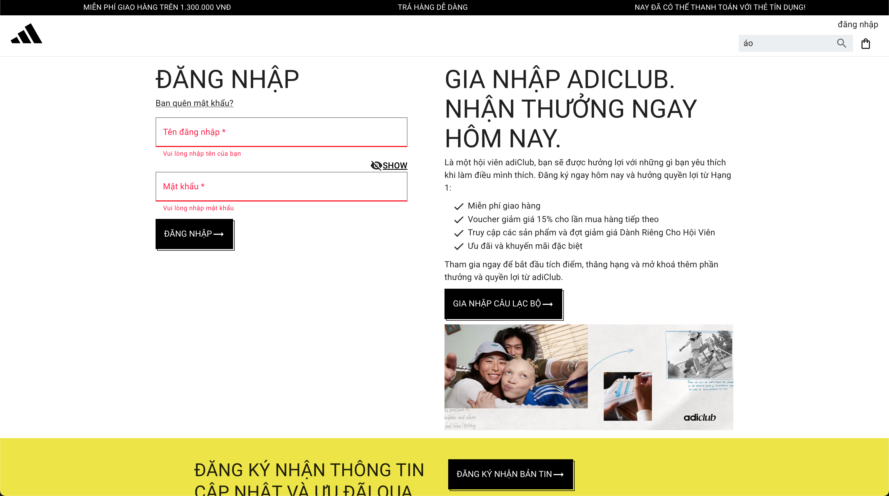
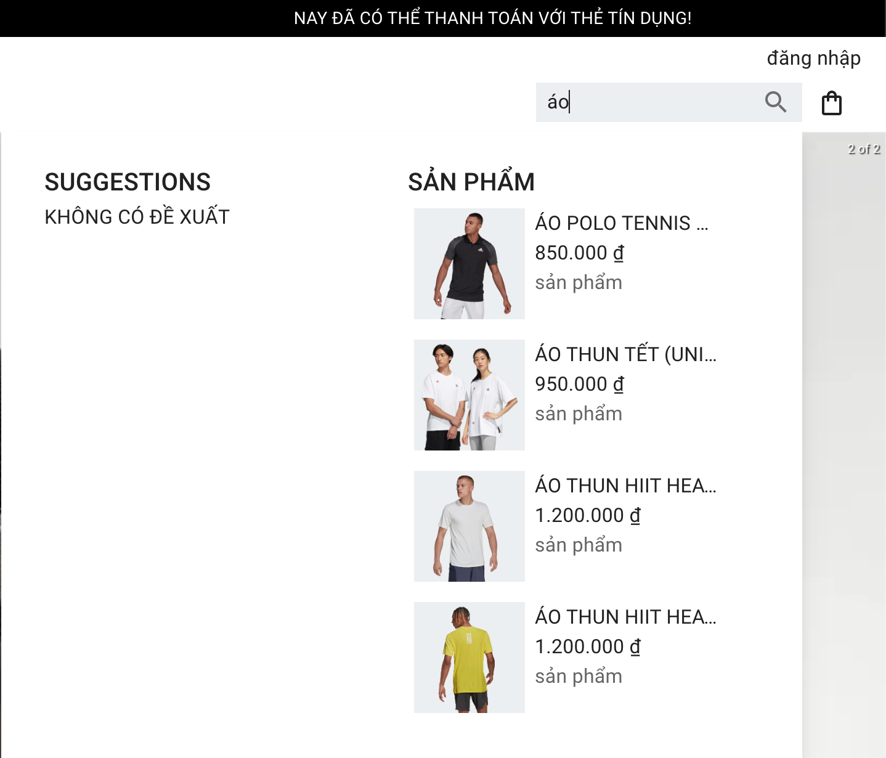
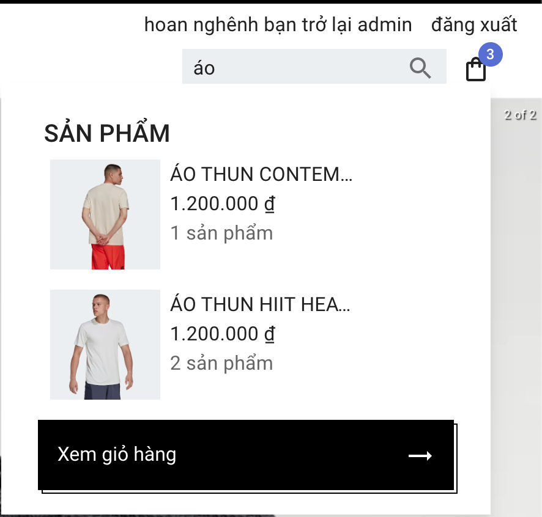
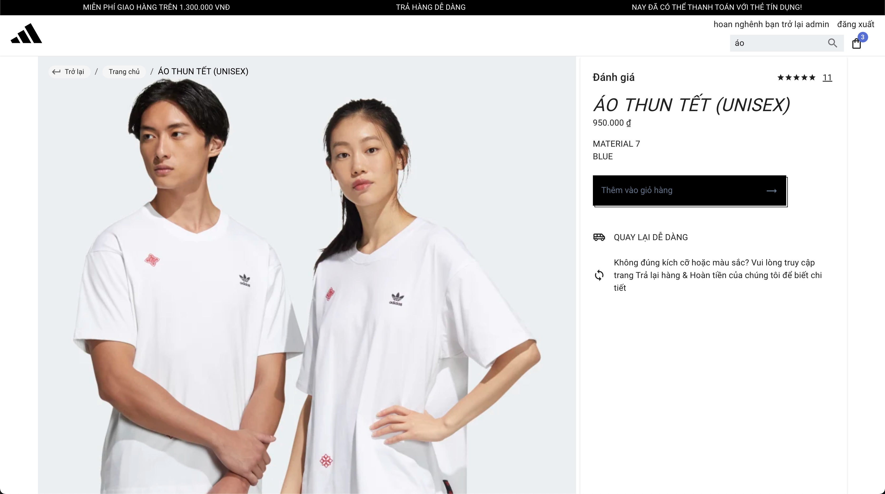
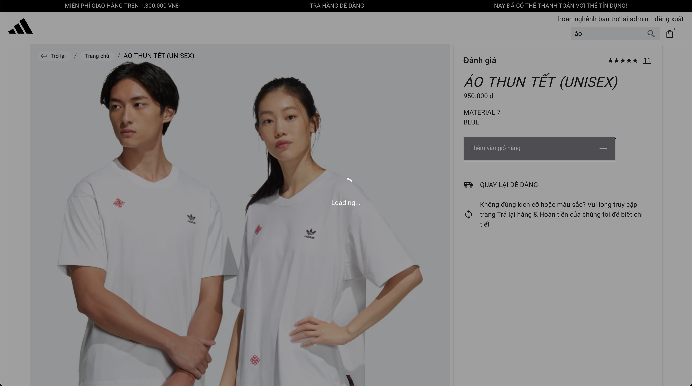
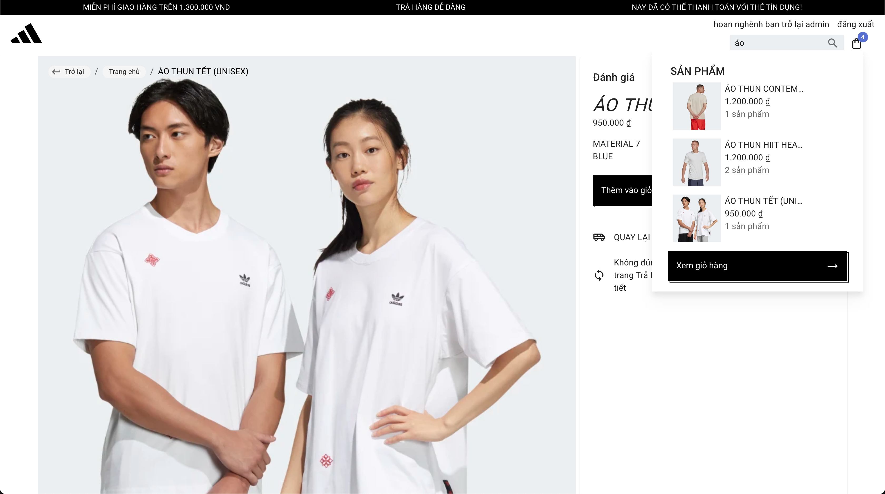
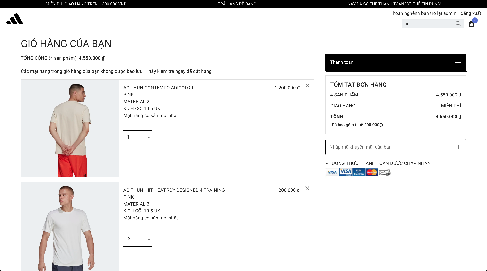
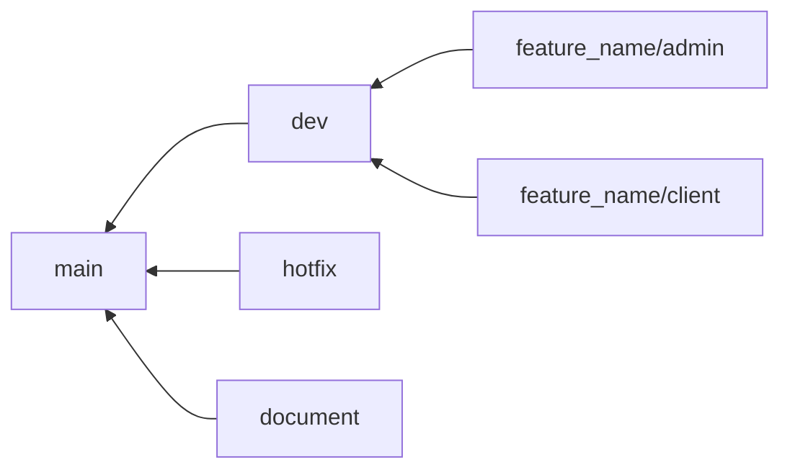

# Introduction

This is a mini Adidas e-commerce site using `NextJS`, `Tailwind CSS`, `MUI`, `react-hook-form`, `redux`

Project URL: https://mock-project-navy.vercel.app/

# Client Site Features

## Client Login, Logout

Click `đăng nhập` on Header, or click [this link](https://mock-project-navy.vercel.app/login)

```
username: admin
password: admin123
```



User cannot go back to login page once logged-in

## Search on Header

Search directly on Header on search field



## Show shopping cart on Header

Click on shopping cart icon to view shopping cart


## Show Product Detail

Click on product on homepage to access to product detail page



## Add Product

On product detail page, click `Thêm giỏ hàng` to add to shopping cart

1. Click `Thêm giỏ hàng`
   

2. Update shopping cart on `shoping cart icon`
   

## Shopping Cart Page

Click `Xem giỏ hàng` on shopping cart icon dropdown, or click [this link](https://mock-project-navy.vercel.app/cart)



## Github Branch Name Convention


